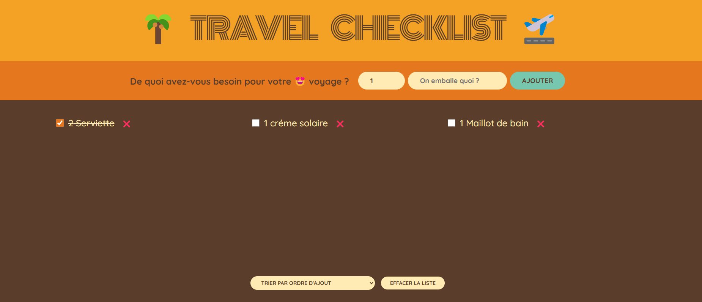

# Suitcase Prep List


Effortlessly organize your packing process with **Suitcase Prep List**! This app allows you to create and manage a packing list for your trips. Track what’s packed, adjust quantities, and sort items for a stress-free travel experience. Whether you’re planning a weekend getaway or a long adventure, this app keeps everything in check.

---

## How to Use
For local use:
1. Ensure **Node.js** and **npm** are installed on your system.
2. Run the following commands in your terminal:
   ```bash
   npm install
   npm start

### Features
- Select the quantity for each item.
- Enter an item name and click the "Ajouter" button to add it to your list.
- The list dynamically updates:
- Total item count.
- Packed percentage as you toggle the checkboxes.
- Remove items by clicking the red cross button.
- Sort the list by:
- Items packed,
- Date added,
- Alphabetical order.

### Dependencies
This project requires the following tools and libraries:

- Node.js and npm for package management and running the app.
- React for the front-end framework.